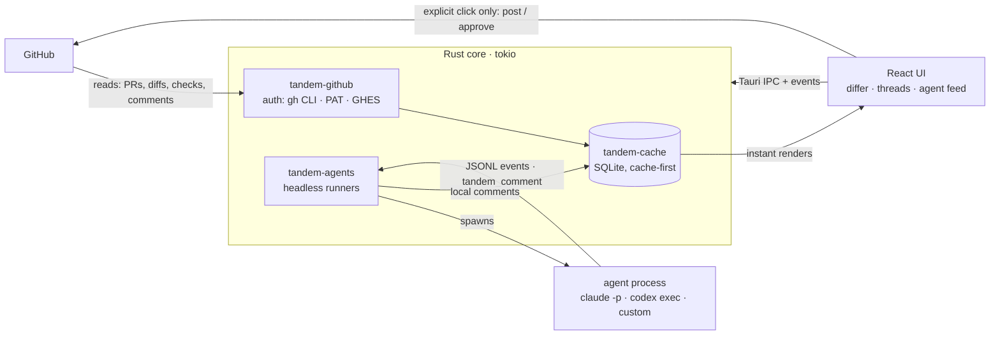
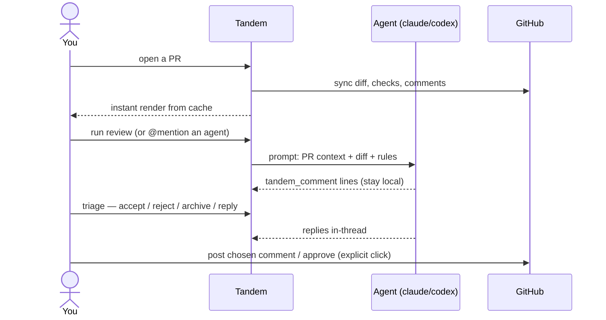

# Tandem

**Local-first code review that works with your agents.**

Tandem is a desktop app (Tauri 2 + Rust + React) for reviewing GitHub pull
requests with AI agents riding along. It pulls everything about a PR from
GitHub — diff, checks, reviews, approvers, comments — renders a fast,
pretty differ, and lets a locally-run agent (Claude, Codex, or any custom
command) review the diff with you.

The twist: **agent comments never go to GitHub on their own.** They
land as local comments in Tandem, where you triage them (accept / reject
/ archive), discuss them in threads (@mention any agent), and — only
when you explicitly click post — push a chosen comment or an approval
back to GitHub. Two riders, one bike: the agents pedal with you, but
you steer.

## How it works



And the review loop itself:



- **Cache-first**: the UI renders instantly from SQLite, background syncs
  refresh from GitHub, and sync state is always visible.
- **Bring your own AI**: reuse a CLI login (claude/codex), supply an API
  key, or point at a custom endpoint. Configure everything in-app.
- **Agents know they're reviewing**: each run gets a context block (PR,
  diff, rules) and a simple contract — emit
  `{"type":"tandem_comment", ...}` lines — inspired by
  [hunk](https://github.com/modem-dev/hunk).
- **Obvious logging**: every run writes a JSONL event log you can tail in
  the UI or grep on disk.

## Install

One-time install; after that Tandem updates itself in-app (an update
pill appears in the header, and settings → Version can switch or roll
back to any release).

**macOS / Linux — one-liner**

```sh
curl -fsSL https://raw.githubusercontent.com/matthewmyrick/code-review/main/scripts/install.sh | sh
```

**macOS — Homebrew**

```sh
brew install --cask matthewmyrick/tap/tandem
```

**Windows — one-liner**

```powershell
powershell -c "irm https://raw.githubusercontent.com/matthewmyrick/code-review/main/scripts/install.ps1 | iex"
```

**Direct downloads** (stable links, always the latest release):
[macOS arm64](https://github.com/matthewmyrick/code-review/releases/latest/download/Tandem-macos-arm64.dmg) ·
[macOS x64](https://github.com/matthewmyrick/code-review/releases/latest/download/Tandem-macos-x64.dmg) ·
[Windows](https://github.com/matthewmyrick/code-review/releases/latest/download/Tandem-windows-x64-setup.exe) ·
[Linux AppImage](https://github.com/matthewmyrick/code-review/releases/latest/download/Tandem-linux-x86_64.AppImage) ·
[Linux deb](https://github.com/matthewmyrick/code-review/releases/latest/download/Tandem-linux-amd64.deb) —
or browse [all releases](https://github.com/matthewmyrick/code-review/releases).

> macOS note: builds aren't notarized yet. The install script and the
> Homebrew cask handle the quarantine flag for you; for a manual dmg
> install, right-click → Open on first launch.

## Building from source

Prereqs: Rust (stable), Node 22+, pnpm, and optionally the `gh` CLI
(easiest auth).

```sh
pnpm install
pnpm tauri dev
```

In the app: **settings → GitHub auth** (defaults to your `gh` CLI
session) → add a repo (browse your orgs or type `owner/name`) → pick a
PR → add an agent → **run review**.

## Project layout

| Path                   | What                                                      |
| ---------------------- | --------------------------------------------------------- |
| `crates/tandem-core`   | Domain types: PRs, diffs, local comments, agent specs     |
| `crates/tandem-github` | GitHub REST client — reads + explicit user-action writes  |
| `crates/tandem-cache`  | SQLite cache, local review store, 3-day merged-PR archive |
| `crates/tandem-agents` | Agent runners (headless claude/codex/custom), JSONL logs  |
| `src-tauri`            | Tauri shell: commands, events, settings                   |
| `src/`                 | React frontend (differ, panels, settings)                 |
| `docs/`                | Architecture, sandboxing (v2 Docker+squid), roadmap       |

## Optional file config (dotfiles-friendly)

Everything is configurable in the GUI, but if you keep dotfiles you can
declare repos, default filters/sort, and agents in
`~/.config/tandem/tandem.yaml` (or point `$TANDEM_CONFIG` at a file).
Present fields override GUI settings at startup and declared agents are
upserted by name; no file means no change. See
[examples/tandem.yaml](examples/tandem.yaml).

## Standards

Strict CI is the deploy gate: if a PR is green, it's safe to ship. No
source file exceeds **400 lines**. See [CONTRIBUTING.md](CONTRIBUTING.md)
and [AGENTS.md](AGENTS.md).

## Security model (v1 → v2)

v1 runs agents as local processes — same trust level as running the CLI
yourself. GitHub writes happen only behind explicit user clicks; agents
have no write path. **v2 moves agent execution into Docker with a squid
proxy** so each agent can only reach the endpoints you allowlist. The
`network_allowlist` field already exists on every agent spec; see
[docs/SANDBOXING.md](docs/SANDBOXING.md) for the plan.
